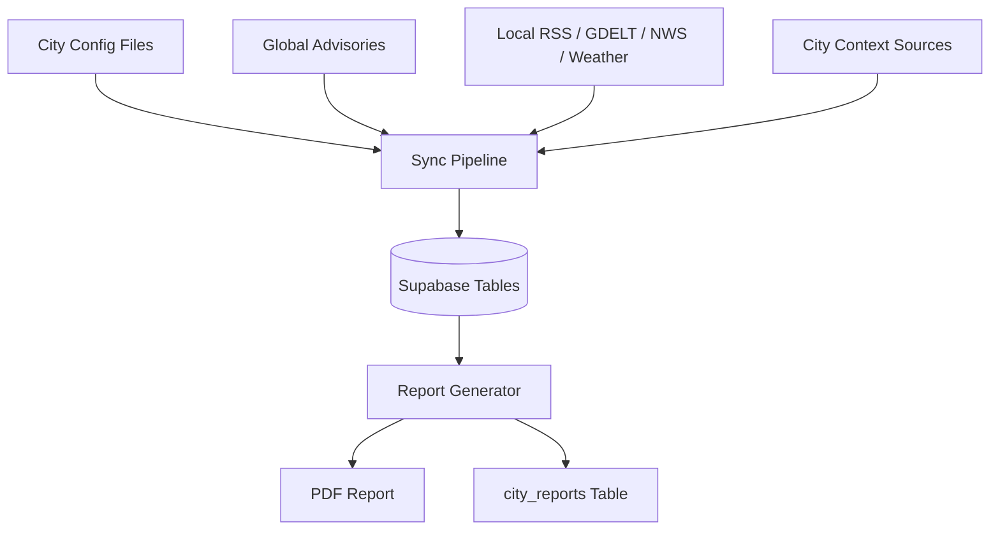
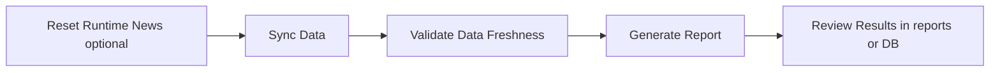
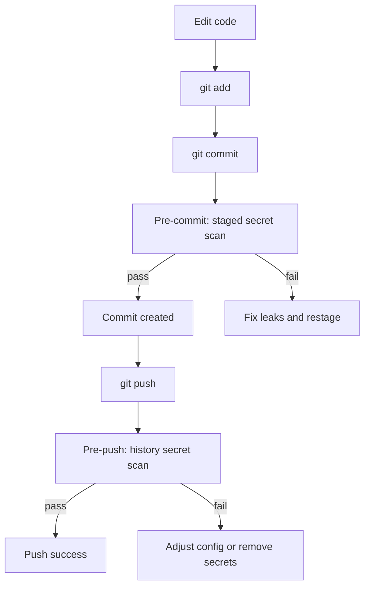

# Travel Intelligence Backend

Simple guide for running, understanding, and securing this project.

## What This Project Does
This project collects travel-relevant data (news, alerts, weather, advisories, and city context), stores it in Supabase, and generates city intelligence reports.

Main outcomes:
- Sync fresh data for one city or all cities.
- Generate a city report (PDF and/or DB record).
- Keep secret handling safe with DevSecOps checks before commit and push.

## High-Level Architecture


## End-to-End Runtime Flow


## Prerequisites
- Python 3.12+ recommended.
- Supabase project and credentials.
- OpenAI API key for report reasoning.

## Environment Setup
1. Install dependencies:
```bash
pip install -r requirements.txt
```

2. Create local secrets file from template:
```bash
# PowerShell
Copy-Item .env.example .env.local
```

3. Fill values in `.env.local` (local only, never commit):
- OPENAI_API_KEY
- SUPABASE_URL
- SUPABASE_SERVICE_ROLE_KEY
- STORAGE_BACKEND=supabase
- LLM_PROVIDER=openai

4. Install git hooks (required for DevSecOps checks):
```bash
python -m pre_commit install
python -m pre_commit install --hook-type pre-push
```

## Most Important Commands

### 1) First-Time Setup (or Full Reset)
```bash
python scripts/sync_supabase.py --all --reset --force
```

### 2) Daily Fast Sync (recommended)
```bash
python scripts/reset_and_sync.py
```

Equivalent manual flow:
```bash
python scripts/reset_runtime_news.py -y
python scripts/sync_supabase.py --all --skip-context --force
```

### 3) Sync One City (example: Miami)
```bash
python scripts/sync_supabase.py --city miami --skip-context --force
```

### 4) Generate One City Report
```bash
python run_report.py miami
```

### 5) Generate All City Reports (DB-first, no PDF)
```bash
python run_report.py --all --skip-pdf
```

### 6) Show Available Cities
```bash
python run_report.py --list-cities
```

## How To See Results

### Local Output
- PDF reports are written to the `reports/` folder when PDF generation is enabled.

### Database Output
- Synced data is stored in Supabase runtime tables.
- Final report payloads are saved in `city_reports`.

### Quick Validation Run
```bash
python scripts/sync_supabase.py --city miami --skip-context --force
python run_report.py miami
```

If successful, you should see:
- Sync complete for miami.
- Report generated successfully.

## DevSecOps and Secret Safety

### What Is Enforced
- `.env.local` is ignored by git.
- Only `.env.example` is trackable.
- Pre-commit hook scans staged files for secrets.
- Pre-push hook scans git history for secrets.
- CI blocks forbidden env files and runs security checks.

### When DevSecOps Runs Automatically
- `git commit` (any branch, local machine): runs pre-commit hook `scan-staged-secrets`.
- `git push` (any branch, local machine): runs pre-push hook `scan-repo-history-secrets`.
- Pull request to GitHub: runs CI workflow checks (`check-forbidden-files` and `validate-important-services`).
- Push to `main` on GitHub: runs CI workflow checks (`check-forbidden-files` and `validate-important-services`).
- Scheduled sync/report workflows are time-based or manual (`workflow_dispatch`), not triggered by every push.

In short: local hooks protect every commit/push from your machine, and GitHub CI protects PRs and `main`.

### Secure Git Flow


### Manual Security Commands
Run these before committing if you want extra confidence:
```bash
python scripts/check_staged_secrets.py
python scripts/scan_repo_secret_history.py
```

## Recommended Daily Workflow
1. Pull latest changes.
2. Run daily sync:
```bash
python scripts/reset_and_sync.py
```
3. Generate report(s):
```bash
python run_report.py miami
```
4. Validate security before git operations:
```bash
python scripts/check_staged_secrets.py
python scripts/scan_repo_secret_history.py
```
5. Commit and push.

## Troubleshooting

### Secret scan fails on commit/push
- Read the generated report path shown in terminal.
- Remove real secrets from tracked files.
- If it is a known false positive, tune `.gitleaks.toml` narrowly (path + pattern scoped).
- Re-run scans.

### Report generation fails
- Ensure sync ran successfully first.
- Verify required env vars in `.env.local`.
- Try city-specific sync:
```bash
python scripts/sync_supabase.py --city miami --force
```

### No PDF generated
- Check whether `--skip-pdf` was used.
- Confirm write permissions for `reports/`.

## Key Scripts Reference
- `scripts/sync_supabase.py`: Main data sync (single city or all).
- `scripts/reset_runtime_news.py`: Clear runtime news/weather only.
- `scripts/reset_and_sync.py`: Combined reset + sync workflow.
- `run_report.py`: Generate report(s) from synced data.
- `scripts/check_staged_secrets.py`: Pre-commit staged secret scanner.
- `scripts/scan_repo_secret_history.py`: Pre-push git history scanner.

## Notes
- Keep secrets only in `.env.local`.
- Never commit `.env`, `.env.local`, or other local secret files.
- Rotate tokens immediately if you suspect exposure.
